# LangTeach Dev Workflow

This document describes the end-to-end development process for LangTeach, from raw idea to merged pull request. The workflow is designed to run with AI agents handling most of the mechanical work (QA review, code review, UI review, PR monitoring) while keeping the human in control of three things: product decisions, plan approval, and final merge.

The loop is intentionally strict. Every task passes through the same gates in the same order. This consistency means any agent can pick up any task without ambiguity, and no step gets skipped under time pressure.

```mermaid
flowchart TD
    A([Idea / Feedback]) --> B

    subgraph DISCOVERY ["Discovery"]
        B["/pm session\nDiscuss features, priorities, UX"]
        B --> C["Create GitHub Issues\nAcceptance criteria, labels, priority"]
    end

    subgraph READINESS ["Issue Readiness"]
        C --> D["/qa review\nValidate issue quality"]
        D --> E{qa:ready?}
        E -- "No — iterate" --> C
        E -- "Yes" --> F["Add qa:ready label\nIssue appears in sprint board"]
    end

    subgraph PICKUP ["Task Pickup"]
        F --> G["Pick highest-priority unassigned issue\nP0 > P1 > P2, current milestone"]
        G --> H["Self-assign issue\ngh issue edit --add-assignee @me"]
        H --> I["Fetch sprint branch\nEnterWorktree task-tN-short-name\nHook auto-installs deps + copies env files"]
    end

    subgraph PLANNING ["Planning"]
        I --> J["Write plan\nplan/langteach-beta/taskN-name.md"]
        J --> K["review-plan agent\nValidate plan vs. codebase"]
        K --> L{Plan approved?}
        L -- "Needs revision\nAgent evaluates critically\nfix valid, push back on rest" --> J
        L -- "Deadlock after 2 rounds\nescalate to user" --> L2["User decides"]
        L2 --> J
        L -- "Approved" --> M
    end

    subgraph IMPLEMENTATION ["Implementation"]
        M["Implement\nCode, commits on task branch"]
        M --> N["Pre-push checks\nbicep build · dotnet build · dotnet test\nfrontend build · npm test"]
        N --> O{All pass?}
        O -- "Fix failures" --> M
        O -- "Pass" --> P
    end

    subgraph QUALITY ["Quality Gates"]
        P["qa-verify agent\nAll acceptance criteria met?"]
        P --> Q{QA verdict}
        Q -- "FAIL / GAPS" --> M
        Q -- "PASS" --> R

        R["review + architecture-reviewer agents\n+ prompt-health-reviewer if PromptService.cs changed\nRun in parallel"]
        R --> S{Review verdicts}
        S -- "FAIL / NEEDS REVISION" --> M
        S -- "PASS WITH NOTES\nlog to backlog" --> T
        S -- "PASS" --> T

        T{"area:frontend\nor area:design?"}
        T -- "No" --> OBS
        T -- "Yes" --> U

        U["review-ui agent\nScreenshots, interaction, responsive\nFull report to file, compact summary to caller"]
        U --> UV{UI verdict}
        UV -- "NEEDS WORK" --> M
        UV -- "GOOD / POLISHED\nlog unfixed items" --> OBS
    end

    subgraph OBSERVATIONS ["Log Observations"]
        OBS["Log out-of-scope observations\nto plan/observed-issues.md"]
        OBS --> V
    end

    subgraph PR ["Pull Request"]
        V["Push branch\nOpen PR against sprint branch\nCloses #N in body"]
        V --> W["CodeRabbit cron\nEvery 5 min: check CI + comments"]
        W --> X{CI + comments?}
        X -- "CI fail" --> M
        X -- "Valid comments" --> M
        X -- "Decline comments\nreply with reasoning" --> W
        X -- "3 rounds or architectural\ndisagreement" --> Y2["Stop + notify user"]
        X -- "All clear" --> Y
    end

    subgraph CLOSE ["Close"]
        Y["Notify user\nPR ready for review"]
        Y --> Z["User reviews + merges to sprint branch"]
        Z --> AA["task-merged agent:\nClose issue + move to Ready to Test"]
        AA --> AB["ExitWorktree remove"]
        AB --> G
    end

    subgraph DEPLOY ["Deploy"]
        Z2["User triggers merge-sprint-to-main\nGitHub Action (on demand)"]
        Z2 --> Z3["CD pipeline deploys main to Azure"]
    end

    style DISCOVERY fill:#f0f4ff,stroke:#94a3d8
    style READINESS fill:#fdf4ff,stroke:#c084fc
    style PICKUP fill:#f0fdf4,stroke:#86efac
    style PLANNING fill:#fffbeb,stroke:#fcd34d
    style IMPLEMENTATION fill:#fff7ed,stroke:#fdba74
    style QUALITY fill:#fef2f2,stroke:#fca5a5
    style OBSERVATIONS fill:#fefce8,stroke:#facc15
    style PR fill:#f0fdfa,stroke:#5eead4
    style CLOSE fill:#f8fafc,stroke:#94a3b8
    style DEPLOY fill:#ecfdf5,stroke:#34d399
```



## Phase Descriptions

**Discovery** starts with a `/pm` session: an interactive conversation that evaluates the idea against the teacher workflow, the current phase goals, and the demo timeline before anything gets written down. Only ideas that survive PM scrutiny become GitHub Issues. Issues include acceptance criteria, labels (priority, area, type), and milestone assignment.

**Issue Readiness** is a separate gate. Just because an issue exists does not mean it is ready to implement. The `/qa` skill reviews whether the acceptance criteria are testable, unambiguous, and scoped correctly. If the issue touches data (new tables, schema, JSON data files, content types, entity relationships), QA also invokes Sophy to review the issue definition for hidden data model implications before approving. The issue iterates until it earns the `qa:ready` label. This label is the only signal an agent needs to know a task is safe to pick up.

**Task Pickup** is deliberately mechanical. Agents query `gh milestone list --state open` to find the current milestone (never hardcoded), sort by priority (P0 before P1 before P2), skip assigned issues, self-assign immediately to prevent conflicts, fetch the active sprint branch, and create an isolated git worktree. A post-creation hook automatically copies environment files from the main repo and installs dependencies (`npm ci` for frontend and e2e, `dotnet restore` for backend), so agents start with a fully working environment. The worktree keeps the main directory clean and allows multiple agents to work in parallel without stepping on each other.

**Planning** happens inside the worktree. The agent writes a plan file, then runs the `review-plan` agent to validate the approach against the actual codebase (not assumptions). When the reviewer flags issues, the agent does not stop. It critically evaluates each finding, fixes what is valid, pushes back with reasoning on what it disagrees with, and re-runs the review. Only if the agent and reviewer fundamentally disagree after two rounds does the user get involved. This keeps the human out of mechanical iteration while preserving their authority on real architectural disputes.

**Implementation** is the only phase without a fixed checklist beyond the pre-push checks. The agent codes, commits incrementally, and runs the full check suite (Azure Bicep, .NET build and tests, frontend build and unit tests) before moving on. Any failure loops back to implementation, not forward. One hard rule: every main functionality must include an e2e happy path test, planned at task start (not added as an afterthought). Unit tests are required for any modified frontend component or hook.

**Quality Gates** run after pre-push checks pass. The first gate (`qa-verify`) is sequential; the next batch (`review`, `architecture-reviewer`, and conditionally `prompt-health-reviewer`, `Sophy data model review`, and/or `pedagogy-reviewer`) run in parallel; the last (`review-ui`) is conditional.
- `qa-verify` checks whether every acceptance criterion from the original issue is demonstrably met. Returns a compact checklist (under 2000 chars) with MET/NOT MET/PARTIAL status per criterion and test coverage summary.
- `review` performs a code quality review against the sprint branch (auto-detected), looking for bugs, security concerns, missing validation, and error handling. Minor notes that are not worth fixing immediately are logged to `plan/code-review-backlog.md` rather than blocking the PR.
- `architecture-reviewer` runs in parallel with `review` and has a different lens: it cross-references the diff against the rest of the codebase to detect inconsistent patterns, duplicated logic, missing reuse of shared utilities, and convention breaks. It reads 3-5 similar existing files for each changed file and compares. The canonical failure case it prevents: a new CI workflow that runs `npm run build` without the VITE_* env vars that the existing `frontend.yml` passes to the same command (this was caught by CodeRabbit on PR #197 but missed by the code reviewer). Minor notes go to `plan/code-review-backlog.md`; NEEDS REVISION verdicts require fixes before proceeding.
- `prompt-health-reviewer` runs in parallel with the other reviewers **only when the PR changes `PromptService.cs`**. It checks whether the changes introduce redundant constraints, contradictions between sections, negative bloat ("NEVER do X" instead of "do Y"), stale patches, or duplication. Critical findings (contradictions that confuse the model) block the PR; important findings get logged to `plan/code-review-backlog.md`. This per-PR gate prevents prompt template drift; the sprint-close agent also runs a full-file review as a periodic sweep.
- `pedagogy-reviewer` (Isaac) runs in parallel with the other reviewers **only when the PR changes pedagogy config files** (`data/pedagogy/*.json`, `data/section-profiles/*.json`, `data/pedagogy/cefr-level-rules/*.json`). Isaac reads `data/pedagogy/AUTHORING.md` first to understand the additive model rules, then evaluates whether override strings follow the authoring guide (focus not format, specific enough, 1-3 sentences max), exercise type references are valid, CEFR level boundaries are respected, and there are no contradictions between section profiles and template overrides. RETHINK verdicts block the PR (pedagogy errors in config propagate to every generated lesson); ADJUST requires fixes; SOUND proceeds.
- `review-ui` runs only when the issue touches frontend or design. It spins up the e2e stack, takes screenshots across viewports and user flows, and evaluates visual quality and interaction correctness. The full report is written to `e2e/screenshots/review-ui/REPORT.md`; the agent returns only a compact summary (verdict + one-liner per finding) to keep the caller's context small. Minor findings that are not fixed are logged to `plan/ui-review-backlog.md`.

Any gate can send the task back to implementation. The loop repeats until all three pass.

**Log Observations** captures things the agent noticed during implementation that are outside the current task's scope (similar bugs in other components, naming inconsistencies, UX rough edges on other screens). These are logged to `plan/observed-issues.md` with the source issue number, date, severity, and a one-line description. The PM periodically batches these into future GitHub issues. This prevents out-of-scope observations from silently disappearing or causing scope creep.

**E2E Stack Contention** is handled gracefully. Only one e2e stack can run at a time. If an agent needs the stack (for e2e tests or UI review) but another agent owns it, the agent stops, notifies the user, and starts a cron that checks every 5 minutes whether the stack has been freed. When the containers disappear, the cron notifies the user and the agent can proceed.

**Pull Request** opens against the active sprint branch (not main) with a `Closes #N` reference in the body for documentation. Note: `Closes #N` does NOT auto-close the issue when the PR targets a sprint branch (auto-close only works for PRs merged into the default branch). The agent must close the issue manually after merge. Since CodeRabbit only auto-reviews PRs targeting main, the agent immediately posts `@coderabbitai review` as a PR comment to trigger the review manually. A cron then runs every five minutes to check CI status and new CodeRabbit comments. The agent evaluates each comment critically (not every automated suggestion is correct), fixes what is genuinely valid, replies to declined suggestions with reasoning, and pushes fixes. Safety limits apply: maximum 3 fix-and-push rounds, and the agent stops on test failures or architectural disagreements rather than looping indefinitely. If the agent stops, the user is notified.

**Close** is the human step. The user receives a notification that the PR is ready, reviews at their own pace, and merges to the sprint branch. After merge, the `task-merged` agent runs: it manually closes the GitHub issue (since auto-close doesn't work for sprint-branch PRs), then moves it to "Ready to Test" on the project board (not "Done") so the user can do a final sanity check. The worktree is then removed and the cycle starts again with the next highest-priority issue.

**Deploy** is decoupled from the development loop. The sprint branch accumulates merged PRs. When the user is satisfied with the sprint branch state, they trigger the `merge-sprint-to-main` GitHub Action. This merges the sprint branch into main, and the existing CD pipeline deploys main to Azure automatically. Deploy freeze simply means not triggering the merge action; the sprint branch keeps receiving work while main and Azure stay stable.

**Sprint Close** is a three-stage process triggered when all sprint work is done:

1. **Backlog triage (PM, interactive):** The PM reads the three backlog files (`plan/code-review-backlog.md`, `plan/ui-review-backlog.md`, `plan/observed-issues.md`) and classifies each entry as FIX NOW (blocks sprint quality), NEXT SPRINT (batch into a themed issue), or DELETE (not worth tracking). The user reviews and approves the triage. FIX NOW items get implemented via normal worktree flow before proceeding. NEXT SPRINT items are grouped into `type:polish` or `type:tech-debt` issues that go through the standard `/qa` gate.

2. **Verification and quality gate (sprint-close agent):** After backlogs are clean, the `sprint-close` agent runs. It verifies all milestone issues are closed and on the board, then runs a three-phase quality gate in order:
   - **Teacher QA (Phase 2):** All personas run against the live sprint branch.
   - **Prompt health review (Phase 2b):** A `prompt-health-reviewer` agent audits both `PromptService.cs` and `data/section-profiles/*.json` for redundant constraints, contradictory instructions, negative bloat (in guidance strings), stale patches, and duplication. Findings are logged to `plan/sprints/prompt-health-review-<sprint-slug>.md`. Running this BEFORE the pedagogy review means the pedagogy expert reviews clean templates, not noise.
   - **Pedagogy review (Phase 3):** A `pedagogy-reviewer` agent evaluates Teacher QA output for sprint-level quality AND reviews the section profile guidance strings directly (CEFR progression, activity type appropriateness, duration estimates, scaffolding progression).

   The agent returns a READY/NOT READY verdict. Blockers: pedagogy RETHINK on any systemic issue, or critical prompt health findings (contradictions that actively produce wrong output).

3. **Cleanup (after user triggers merge):** Close the GitHub milestone, delete the sprint branch, update memory (task status, sprint overviews), clear the backlog files.

---

## Branch Model

```
main (deploys to Azure, advances only via merge action)
  └── sprint/<milestone-slug> (integration branch, agents PR here)
        └── task/t<N>-<description> (feature branches from worktrees)
```

- Agents never commit or push directly to main or sprint branches
- Feature branches are created inside worktrees and PRs target the sprint branch
- Main only advances when the user triggers the `merge-sprint-to-main` GitHub Action
- After any direct push to main (non-code files, hotfixes), the sprint branch is synced: `git checkout sprint/<slug> && git merge main && git push`

## Worktree Setup

When an agent enters a worktree via `EnterWorktree`, a post-creation hook (`.claude/hooks/worktree-setup.sh`) automatically:
1. Copies environment files from the main repo (`.env`, `.env.e2e`, `frontend/.env.local`, `frontend/.env.e2e`, `e2e/.env`, `infra/.env`)
2. Installs frontend dependencies (`npm ci`)
3. Installs e2e dependencies (`npm ci` in `e2e/`)
4. Restores backend dependencies (`dotnet restore`)

If builds fail in a worktree despite the hook, verify dependencies manually.

## Windows / Git Bash Notes

The Bash tool runs in Git Bash on Windows. Git Bash automatically translates Unix absolute paths to Windows paths (e.g., `/opt/bin/tool` becomes `C:/Program Files/Git/opt/bin/tool`). This breaks `docker exec` commands with paths meant for inside containers. Fix: prefix with `MSYS_NO_PATHCONV=1`.

## Gate Summary

| Gate | Tool | Pass Condition |
|------|------|----------------|
| Issue readiness | `general-purpose` agent (with qa skill instructions) | `qa:ready` label applied |
| Plan validation | `review-plan` agent (invokes Sophy if plan touches data) | Plan approved |
| Pre-push checks | Bash | bicep + dotnet + frontend all green |
| Acceptance criteria | `qa-verify` agent | PASS verdict |
| Code review | `review` agent | PASS or PASS WITH NOTES |
| Consistency review | `architecture-reviewer` agent | PASS or PASS WITH NOTES (run in parallel with `review`) |
| Prompt health (per-PR) | `prompt-health-reviewer` agent | CLEAN or NEEDS CLEANUP (only if `PromptService.cs` changed, run in parallel with `review`); URGENT blocks push |
| Data model review (per-PR) | Sophy (via general-purpose agent) | APPROVE or NEEDS CLARIFICATION (only if diff touches Models, DTOs, Migrations, data JSON, contentTypes; run in parallel with `review`); NEEDS CLARIFICATION blocks push |
| Pedagogy config review (per-PR) | `pedagogy-reviewer` agent (Isaac) | SOUND, ADJUST, or RETHINK (only if diff touches `data/pedagogy/*.json`, `data/section-profiles/*.json`, `data/pedagogy/cefr-level-rules/*.json`; run in parallel with `review`); RETHINK blocks push |
| Prompt health (sprint close) | `prompt-health-reviewer` agent | Reviews `PromptService.cs` + all `data/section-profiles/*.json`; runs before pedagogy review |
| UI review | `review-ui` agent | GOOD or POLISHED (only if `area:frontend` or `area:design`) |
| CI + CodeRabbit | `gh pr checks` + `gh api` | No failures, no unresolved comments |

## Key Rules

- Never work in `main` directly, always a worktree
- Only pick issues with `qa:ready` label
- Self-assign immediately when picking (signals to other agents)
- PRs target the active sprint branch, not main
- PR body includes `Closes #N` for documentation (auto-close does NOT work for sprint-branch PRs; the `task-merged` agent closes issues manually)
- Never merge, user reviews and merges manually
- After merge: `task-merged` agent closes the issue and moves to "Ready to Test", not "Done" (user does final sanity check)
- Never guess milestone names, always query `gh milestone list --state open`
- E2E happy path test required for every main functionality, planned at task start
- Unit tests required for any modified frontend component or hook
- Never run the frontend dev server locally (`npm run dev`, `npx vite`); frontend runs exclusively inside Docker
- Log out-of-scope observations to `plan/observed-issues.md`, never fix them (scope creep) or ignore them

## Backlogs

| File | What goes there | Who reviews |
|------|----------------|-------------|
| `plan/code-review-backlog.md` | Unfixed findings from `review` agent | PM at sprint end |
| `plan/ui-review-backlog.md` | Unfixed findings from `review-ui` agent | PM at sprint end |
| `plan/observed-issues.md` | Out-of-scope observations from implementation | PM at sprint end |

## Feedback Intake

Feedback arrives via email (robert.freire.bot@gmail.com), audio voice notes, or direct conversation. The processing workflow:

1. Save raw content to `feedback/raw/YYYY-MM-DD-<source>-<description>.txt`
2. Update the person's feedback log in `.claude/memory/`
3. Create or update GitHub Issues for actionable items (with proper labels, milestone, project board)
4. Reply acknowledging the feedback
5. Move the email to the "Processed" IMAP folder

Unprocessed emails remain in Inbox/All Mail. The "Processed" folder is the audit trail of what has been acted on.
