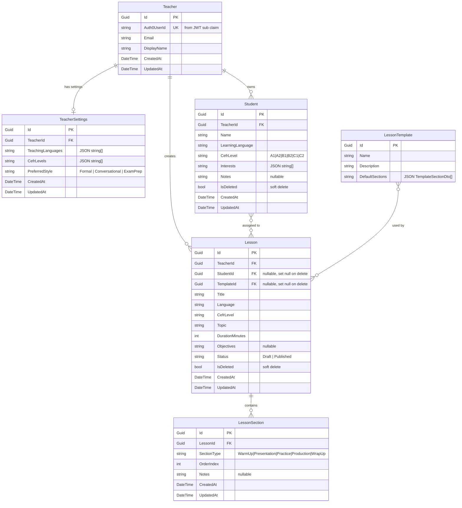

# LangTeach SaaS — Entity-Relationship Diagram (Phase 1)

> Reflects the EF Core schema introduced in T4. JSON-serialized columns are noted but shown as scalar strings in the diagram.

## Notes

- All FKs use `Guid` type.
- `Teacher.Auth0UserId` has a unique index — used to look up the teacher row from the JWT `sub` claim.
- `Student` and `Lesson` use soft delete (`IsDeleted`); hard deletes are not exposed via the API.
- `LessonTemplate` is seeded at startup and is read-only at runtime.
- JSON columns (`TeachingLanguages`, `CefrLevels`, `Interests`, `DefaultSections`) are stored as `nvarchar(max)` strings and serialized/deserialized in the service layer (not via EF JSON owned types) for Azure SQL compatibility.
- The `AuthController.Me()` Teacher upsert is wired in T5, not T4.
