# LangTeach Dev Workflow

This document describes the end-to-end development process for LangTeach, from raw idea to merged pull request. The workflow is designed to run with AI agents handling most of the mechanical work (QA review, code review, UI review, PR monitoring) while keeping the human in control of three things: product decisions, plan approval, and final merge.

The loop is intentionally strict. Every task passes through the same gates in the same order. This consistency means any agent can pick up any task without ambiguity, and no step gets skipped under time pressure.

```mermaid
flowchart TD
    A([Idea / Feedback]) --> B

    subgraph DISCOVERY ["Discovery"]
        B["/pm session\nDiscuss features, priorities, UX"]
        B --> C["Create GitHub Issues\nAcceptance criteria, labels, priority"]
    end

    subgraph READINESS ["Issue Readiness"]
        C --> D["/qa review\nValidate issue quality"]
        D --> E{qa:ready?}
        E -- "No — iterate" --> C
        E -- "Yes" --> F["Add qa:ready label\nIssue appears in sprint board"]
    end

    subgraph PICKUP ["Task Pickup"]
        F --> G["Pick highest-priority unassigned issue\nP0 > P1 > P2, current milestone"]
        G --> H["Self-assign issue\ngh issue edit --add-assignee @me"]
        H --> I["git pull main\nEnterWorktree task-tN-short-name"]
    end

    subgraph PLANNING ["Planning"]
        I --> J["Write plan\nplan/langteach-beta/taskN-name.md"]
        J --> K["/review-plan\nValidate plan vs. codebase"]
        K --> L{Plan approved?}
        L -- "Needs revision\nAgent evaluates critically\nfix valid, push back on rest" --> J
        L -- "Deadlock after 2 rounds\nescalate to user" --> L2["User decides"]
        L2 --> J
        L -- "Approved" --> M
    end

    subgraph IMPLEMENTATION ["Implementation"]
        M["Implement\nCode, commits on task branch"]
        M --> N["Pre-push checks\nbicep build · dotnet build · dotnet test\nfrontend build · npm test"]
        N --> O{All pass?}
        O -- "Fix failures" --> M
        O -- "Pass" --> P
    end

    subgraph QUALITY ["Quality Gates"]
        P["qa-verify agent\nAll acceptance criteria met?"]
        P --> Q{QA verdict}
        Q -- "FAIL / GAPS" --> M
        Q -- "PASS" --> R

        R["review agent\nCode review vs. main"]
        R --> S{Review verdict}
        S -- "FAIL" --> M
        S -- "PASS WITH NOTES\nlog to backlog" --> T
        S -- "PASS" --> T

        T{"area:frontend\nor area:design?"}
        T -- "No" --> V
        T -- "Yes" --> U

        U["review-ui agent\nScreenshots, interaction, responsive"]
        U --> UV{UI verdict}
        UV -- "NEEDS WORK" --> M
        UV -- "GOOD / POLISHED\nlog unfixed items" --> V
    end

    subgraph PR ["Pull Request"]
        V["Push branch\nOpen PR against main\nCloses #N in body"]
        V --> W["CodeRabbit cron\nEvery 5 min: check CI + comments"]
        W --> X{CI + comments?}
        X -- "CI fail" --> M
        X -- "Valid comments" --> M
        X -- "Decline comments\nreply with reasoning" --> W
        X -- "3 rounds or architectural\ndisagreement" --> Y2["Stop + notify user"]
        X -- "All clear" --> Y
    end

    subgraph CLOSE ["Close"]
        Y["Notify user\nPR ready for review"]
        Y --> Z["User reviews + merges manually"]
        Z --> AA["Move issue to Ready to Test\nproject board"]
        AA --> AB["ExitWorktree remove"]
        AB --> G
    end

    style DISCOVERY fill:#f0f4ff,stroke:#94a3d8
    style READINESS fill:#fdf4ff,stroke:#c084fc
    style PICKUP fill:#f0fdf4,stroke:#86efac
    style PLANNING fill:#fffbeb,stroke:#fcd34d
    style IMPLEMENTATION fill:#fff7ed,stroke:#fdba74
    style QUALITY fill:#fef2f2,stroke:#fca5a5
    style PR fill:#f0fdfa,stroke:#5eead4
    style CLOSE fill:#f8fafc,stroke:#94a3b8
```

## Phase Descriptions

**Discovery** starts with a `/pm` session: an interactive conversation that evaluates the idea against the teacher workflow, the current phase goals, and the demo timeline before anything gets written down. Only ideas that survive PM scrutiny become GitHub Issues. Issues include acceptance criteria, labels (priority, area, type), and milestone assignment.

**Issue Readiness** is a separate gate. Just because an issue exists does not mean it is ready to implement. The `/qa` skill reviews whether the acceptance criteria are testable, unambiguous, and scoped correctly. The issue iterates until it earns the `qa:ready` label. This label is the only signal an agent needs to know a task is safe to pick up.

**Task Pickup** is deliberately mechanical. Agents query `gh milestone list --state open` to find the current milestone (never hardcoded), sort by priority (P0 before P1 before P2), skip assigned issues, self-assign immediately to prevent conflicts, pull the latest `main`, and create an isolated git worktree. The worktree keeps `main` clean and allows multiple agents to work in parallel without stepping on each other.

**Planning** happens inside the worktree. The agent writes a plan file, then runs `/review-plan` to validate the approach against the actual codebase (not assumptions). When the reviewer flags issues, the agent does not stop. It critically evaluates each finding, fixes what is valid, pushes back with reasoning on what it disagrees with, and re-runs the review. Only if the agent and reviewer fundamentally disagree after two rounds does the user get involved. This keeps the human out of mechanical iteration while preserving their authority on real architectural disputes.

**Implementation** is the only phase without a fixed checklist beyond the pre-push checks. The agent codes, commits incrementally, and runs the full check suite (Azure Bicep, .NET build and tests, frontend build and unit tests) before moving on. Any failure loops back to implementation, not forward. One hard rule: every main functionality must include an e2e happy path test, planned at task start (not added as an afterthought). Unit tests are required for any modified frontend component or hook.

**Quality Gates** are three sequential agents, each with a different lens:
- `qa-verify` checks whether every acceptance criterion from the original issue is demonstrably met.
- `review` performs a code review against `main`, looking for architectural issues, security concerns, and convention violations. Minor notes that are not worth fixing immediately are logged to `plan/code-review-backlog.md` rather than blocking the PR.
- `review-ui` runs only when the issue touches frontend or design. It spins up the e2e stack, takes screenshots across viewports and user flows, and evaluates visual quality and interaction correctness. Minor findings that are not fixed are logged to `plan/ui-review-backlog.md`.

Any gate can send the task back to implementation. The loop repeats until all three pass.

**Pull Request** opens against `main` with a `Closes #N` reference so the issue auto-closes on merge. A cron runs every five minutes to check CI status and new CodeRabbit comments. The agent evaluates each comment critically (not every automated suggestion is correct), fixes what is genuinely valid, replies to declined suggestions with reasoning, and pushes fixes. Safety limits apply: maximum 3 fix-and-push rounds, and the agent stops on test failures or architectural disagreements rather than looping indefinitely. If the agent stops, the user is notified.

**Close** is the human step. The user receives a notification that the PR is ready, reviews at their own pace, and merges manually. After merge, the issue moves to "Ready to Test" on the project board (not "Done") so the user can do a final sanity check before closing it out. The worktree is then removed and the cycle starts again with the next highest-priority issue.

**End-of-sprint backlog review** closes the loop on deferred findings. At the end of each sprint, the PM reviews both backlogs (`plan/code-review-backlog.md` and `plan/ui-review-backlog.md`) and decides what to do with the accumulated items. Findings are never converted one-to-one into issues — instead, related items are grouped and batched into a single `type:polish` or `type:tech-debt` issue that covers a coherent theme (e.g., "Polish: lesson editor visual consistency" or "Tech debt: error handling gaps in generation endpoints"). Items that are not worth batching are discarded. The resulting batched issues go through the standard `/qa` gate before entering a sprint.

---

## Gate Summary

| Gate | Tool | Pass Condition |
|------|------|----------------|
| Issue readiness | `/qa` skill | `qa:ready` label applied |
| Plan validation | `/review-plan` skill | Plan approved by user |
| Pre-push checks | Bash | bicep + dotnet + frontend all green |
| Acceptance criteria | `qa-verify` agent | PASS verdict |
| Code review | `review` agent | PASS or PASS WITH NOTES |
| UI review | `review-ui` agent | GOOD or POLISHED (only if `area:frontend` or `area:design`) |
| CI + CodeRabbit | `gh pr checks` + `gh api` | No failures, no unresolved comments |

## Key Rules

- Never work in `main` directly — always a worktree
- Only pick issues with `qa:ready` label
- Self-assign immediately when picking (signals to other agents)
- PR body must include `Closes #N` for auto-close on merge
- Never merge — user reviews and merges manually
- After merge: move to "Ready to Test", not "Done" (user does final sanity check)
- Never guess milestone names — always query `gh milestone list --state open`
- E2E happy path test required for every main functionality, planned at task start
- Unit tests required for any modified frontend component or hook

## Feedback Intake

Feedback arrives via email (robert.freire.bot@gmail.com), audio voice notes, or direct conversation. The processing workflow:

1. Save raw content to `feedback/raw/YYYY-MM-DD-<source>-<description>.txt`
2. Update the person's feedback log in `.claude/memory/`
3. Create or update GitHub Issues for actionable items (with proper labels, milestone, project board)
4. Reply acknowledging the feedback
5. Move the email to the "Processed" IMAP folder

Unprocessed emails remain in Inbox/All Mail. The "Processed" folder is the audit trail of what has been acted on.
